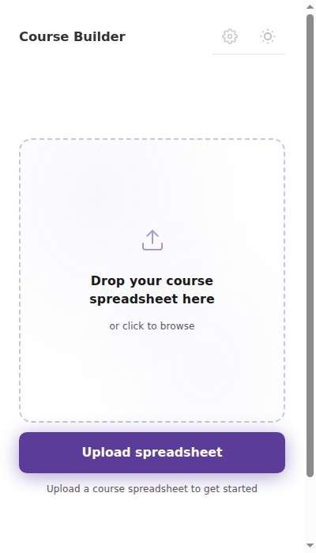
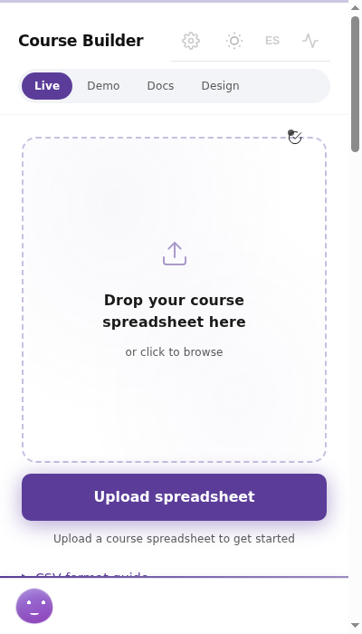
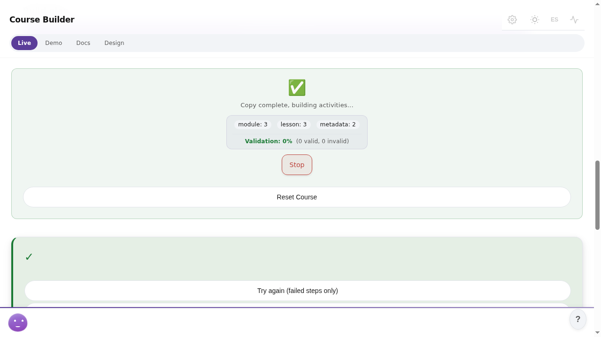

# Testing Chrome extensions with agents (eyes + hands)

This is the pattern we use to let an agent drive and verify a Chrome MV3
extension under test: deterministic DOM assertions first (cheap to review),
screenshots and model calls only where determinism can't reach. Image
processing lives inside the tools — this doc stays on the review side:
what to assert, what the envelopes mean, and how to set it up.

## The shape

1. The agent loads your unpacked extension into its own driven browser via
   the per-call `extension_path` parameter (available on `browser_act`,
   `browser_act_get`, `browser_take_screenshot`, `browser_check_page`).
2. It navigates `chrome-extension://<id>/<page>.html` like any other URL.
3. It asserts with `browser_check_page` (no model): `exists`, `text_eq`,
   `text_contains`, `count_eq`, `attr_eq`, `visible`, `a11y_role(name)`,
   `evaluate`. These return data, not prose — a reviewer reads the checks
   and the pass/fail list, not a screenshot.
4. Screenshots (`browser_take_screenshot`) are evidence artifacts. When one
   must enter a vision context, `browser_compress_shot_tool` prepares it
   and `browser_assert_visual_tool` returns a true/false verdict on a
   stated claim. Prompt the claim, review the verdict — don't hand-roll
   image handling around the tools.
5. Every call returns an envelope (`completed`, `rate_limited`, `timeout`,
   `error`) and never raises. Branch on `status`; treat `error_message`
   as the diagnostic, not the result.

## Setup (operator, once)

Extension loading is code execution in the driven browser, so it is
allowlisted, not open:

```bash
# The service only loads unpacked dirs under this root. Nothing loads
# unless a tool call names it.
NOT_NOVA_ACT_EXTENSION_ROOT=<projects-root>
```

Restart the service after setting it. With the root unset, any
`extension_path` call errors with a message saying so. Paths outside the
root error the same way, as do dirs without `manifest.json`.

## What it looks like

A real run against a course-builder sidepanel, captured by the tools
themselves. Each state below is verified by `check_page` assertions, not
by eyeballing the picture — the pictures are here so a reviewer can see
what the assertions mean.



The starting point. Assertions: the drop zone is `visible`, the upload
button has its accessible name, the status text reads empty. If any of
these fail, the extension didn't boot — no model call will fix that.



Mid-run. Assertions: progress indicator `visible`, status text matches
the expected phase. The agent polls this state; each poll is a DOM read,
not a screenshot.



Late run. Assertions: completion marker present, counts (`module: 3`,
`lesson: 3`) match the plan via `text_contains`. The open-ended read
("what does the status say?") is the one place a model `act_get` earns
its keep, with the result validated against a schema.

## Test-harness pattern (from our suite)

`tests/test_extension.py` + `tests/fixtures/stub-extension/` show the
minimal version. Copy the shape:

- **Stub extension**: `manifest.json` (MV3, minimal) + one HTML page +
  optional service worker. Pin the extension ID by putting a `"key"`
  field in the manifest (base64 public key, test-only throwaway) — the
  ID then derives from the key and is stable across runs, so tests can
  hardcode `chrome-extension://<id>/hello.html`. Without `key` the ID
  is random per load and tests must discover it first.
- **Allowlist in tests**: point the root at a temp dir (monkeypatch
  `EXTENSION_ROOT`) and copy the stub under it. Then prove the
  validation contract, not just the happy path:
  - no path → feature off, plain browser behavior unchanged
  - root unset → clear error
  - path outside root → clear error
  - dir without manifest → clear error
  - stub page loads: screenshot returns `completed` with a real PNG and
    a `chrome-extension://` final URL; `text_contains` on the stub
    heading passes
- **Real extension**: pass the built (unpacked) dir as `extension_path`
  and assert against its real pages the same way. Our suite reads an
  automation sidepanel's status text via `browser_act_get_tool` with a
  `{"status_text": "str"}` schema — the model does the open-ended
  reading, the test asserts the envelope.

## Limits that are intentional

- `mobile=True` with an extension errors. Device emulation flags are
  context-creation options; a loaded extension owns a persistent
  context, so the combination is rejected loudly instead of silently
  rendering the wrong layout.
- Headless is full-Chromium new-headless under the hood. The minimal
  headless-shell binary cannot load extensions at all — the launcher
  picks the capable binary whenever `extension_path` is set, no flag
  needed from the caller.
- Viewport still applies (post-hoc resize on the page). Everything else
  — GPU lock, semaphore, step logging — behaves exactly as without an
  extension.

## What not to put in tests

- No credentials, tokens, account IDs, or internal hostnames. The stub
  manifest `key` is public-key material generated for tests, not a
  secret — but generate your own rather than copying ours.
- No absolute machine paths. Tests resolve the extension dir from the
  repo (built output) or temp fixtures, and the allowlist root comes
  from the environment.
